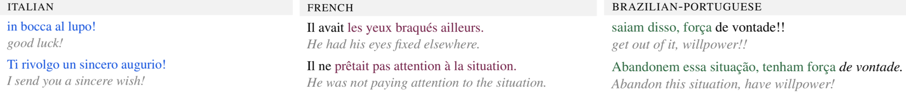

<p align="center">
    
</p>

---

This repository contains XFORMAL,  an evaluation dataset, that consists of multiple formal  rewrites  of  informal  sentences  in  three  Romance languages:  Brazilian Portuguese (BR-PT),French (FR), and Italian (IT).

Access to XFORMAL requires that you first have granted permission to access the [original corpus]((https://github.com/raosudha89/GYAFC-corpus))! (short desciption below)

The XFORMAL corpus was created using the Yahoo Answers corpus: [L6 - Yahoo! Answers Comprehensive Questions and Answers version 1.0](https://webscope.sandbox.yahoo.com/catalog.php?datatype=l). This Yahoo Answers corpus can be requested free of charge for research purposes. Access to XFORMAL (and all versions of the GYAFC dataset) will require users to first gain access to this Yahoo Answers corpus.

Once you have gained access to the L6 corpus, please forward the acknowledgment to Joel Tetreault (tetreaul@gmail.com), along with your affiliation and a short description of how you will be using the data, and we will provide access to XFORMAL!


## Example rewrites

<p align="center">
   
</p>

## Contact

If you use any contents of this repository, please cite us. For any questions, write to ebriakou@cs.umd.edu.

```
@inproceedings{briakou-etal-2021-xformal,
    title = "XFORMAL: A Benchmark for Multilingual Formality Style Transfer",
    author = "Briakou, Eleftheria and Lu, Di and Zhang, Ke and Tetreault, Joel",
    booktitle = "Proceedings of the 2021 Annual Conference of the North American Chapter of the Association for Computational Linguistics (NAACL)",
    year = "2021",
    address = "Online",
    publisher = "Association for Computational Linguistics"
}
```
